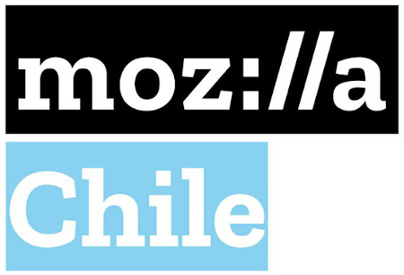

# EventOnline
Eventos y charlas online organizados por la comunidad

[Mozilla Chile](https://mozillachile.cl) es la comunidad de usuarios, entusiastas y
público en general que se identifica con el
[manifiesto de Mozilla](https://www.mozilla.org/es-ES/about/manifesto/), un
proyecto con la misión de propiciar el desarrollo y la innovación en Internet.

Desde aquí podrás unirte a
[nuestros Eventos](https://community.mozilla.org/en/groups/mozilla-chile/?view=events) y estar al
tanto de nuestras reuniones futuras, e inscribirte en ellas.

En nuestro grupo hablamos de Firefox, tecnologías web y la Web Abierta. Acogemos
a usuarios de Firefox y otros productos de Mozilla, desarrolladores web y
desarrolladores de aplicaciones web móviles. Anímate a proponer una charla [siguiendo estos pasos](https://github.com/mozillachile/EventOnline/wiki/%C2%BFC%C3%B3mo-proponer-una-charla%3F).

## Guías para la participación

https://www.mozilla.org/es-ES/about/governance/policies/participation/

